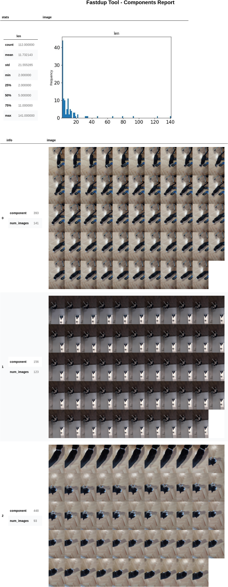

# Master Data Integrity to Clean Your Computer Vision Datasets
##### `Handle Data Leakage. Reduce Labeling Costs. Decrease Computation Time and Expenses.`

Tutorial on how to clean, visualize and understand real-world Computer Vision datasets.

👉 [Link to the Medium Article.](https://towardsdatascience.com/how-to-quickly-design-advanced-sklearn-pipelines-3cc97b59ce16)

# Table of Contents
1. [Motivation](#motivation)
2. [Installation](#installation)
3. [Data](#data)
4. [Usage](#usage)
5. [Licensing, Authors, Acknowledgements](#licensing)

-----

# 1. Motivation <a name="motivation"></a>

Data integrity is one of the biggest concerns for companies and engineers in the latest period.

The amount of data we have to process and understand only gets more significant, and manually looking at millions of samples is not sustainable. Thus, we need tools that can help us navigate our datasets.

We will present a tutorial on decoding a video of my sassy cat and extracting all the frames from it as images. We will use FastDup to visualize different statistics over the pictures dataset.

The main goal is to remove similar/duplicate images from the dataset. In the next section, we will detail why cleaning your dataset from duplicates is crucial. Ultimately, we will look at the outliers before and after removing all the similar photos.



# 2. Installation <a name="installation"></a>

The code is tested with:
* Python 3.9
* Conda 4.12

Create & activate a conda virtual environment:
```shell
conda create --name data-integrity python=3.9
conda activate data-integrity
```

Install requirements:
```shell
pip install -r requirements.txt
```

# 3. Data <a name="data"></a>

We will be working on a video of the most precious thing in my house, my cat. 

[Download video here](https://drive.google.com/file/d/16VgM1QwSIKIWPVkgLJqmHPOUx0GJmFfD/view?usp=share_link).


# 4. Usage <a name="usage"></a>

## Files Structure
After you download the data the structure of the project should look like this:
```text
├── media
├── felix.mp4
├── data_integrity.ipynb
├── publish.py
├── README.md
└── requirements.txt
```

## Run
Everything is within a single notebook called `data_integrity.ipynb`.

Therefore, it is enough to run:
```shell
jupyter notebook data_integrity.ipynb
```


## 5. Licensing, Authors, Acknowledgements <a name="licensing"></a>
Everything is licensed under the MIT license. Therefore, please use, share, and play with the code as long as you give credit to the original author.

----

 If we share any interest and want to discuss this further, please contact me
on [LinkedIn](https://www.linkedin.com/in/pauliusztin/) or by email `p.b.iusztin@gmail.com`.

----

To get up-to-date content about **ML, Computer Vision, MLOps, and freelancing**:

📘 **Follow** me on [LinkedIn](https://medium.com/@pauliusztin)

✉️ **Subscribe** to my [Medium newsletter](https://pauliusztin.medium.com/subscribe)

----

🚀 **Support me** by joining Medium through my [referral link](https://medium.com/membership/@pauliusztin).