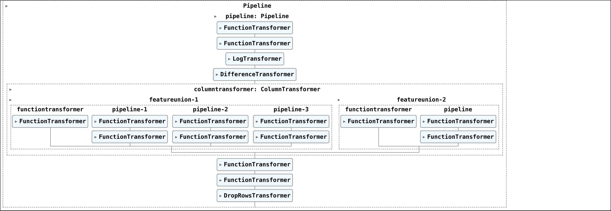

# How to Design Professional Sklearn Pipelines Like a Pro

# Table of Contents
1. [Motivation](#motivation)
2. [Installation](#installation)
3. [Data](#data)
4. [Usage](#usage)
5. [Licensing, Authors, Acknowledgements](#licensing)
6. [Citations](#citations)

# 1. Motivation <a name="motivation"></a>
This tutorial shows how to use *Sklearn Pipelines* at their full capacity by implementing a yearly wheat yield *forecasting model*.

The example shows how to practically use all the elements Sklearn provides to *build professional machine learning pipelines*.

It shows how to compose the following classes/functions from Sklearn to build a professional machine learning pipeline:
* [TransformerMixin](https://scikit-learn.org/stable/modules/generated/sklearn.base.TransformerMixin.html)
* [BaseEstimator](https://scikit-learn.org/stable/modules/generated/sklearn.base.BaseEstimator.html)
* [FunctionTransformer](https://scikit-learn.org/stable/modules/generated/sklearn.preprocessing.FunctionTransformer.html)
* [ColumnTransformer](https://scikit-learn.org/stable/modules/generated/sklearn.compose.ColumnTransformer.html)
* [FeatureUnion](https://scikit-learn.org/stable/modules/generated/sklearn.pipeline.FeatureUnion.html)
* [TransformedTargetRegressor](https://scikit-learn.org/stable/modules/generated/sklearn.compose.TransformedTargetRegressor.html)




# 2. Installation <a name="installation"></a>
The code is tested with:
* Python 3.9
* Conda 4.12

Create & activate a conda virtual environment:
```shell
conda create --name professional-sklearn-pipelines python=3.9
conda activate professional-sklearn-pipelines
```

Install requirements:
```shell
pip install -r requirements.txt
```

# 3. Data <a name="data"></a>
We have used the **dataset** [1](#data) provided by [Pangaea](https://doi.pangaea.de/10.1594/PANGAEA.909132), which tracks global yearly yields for various plants from 1981 to 2016.

Download the dataset [here](https://doi.pangaea.de/10.1594/PANGAEA.909132) and unzip it.
The code expects the data to be in the Sklearn Pipelines tutorial's root folder under a directory named `yields`.

**NOTE:** We found this dataset in this cool [GitHub Repository](https://github.com/awesomedata/awesome-public-datasets). 
You can find all sorts of amazing datasets here for various prototypes or tutorials.

# 4. Usage <a name="usage"></a>
## Files Structure
After you download the data the structure of the project should look like this:
```text
├── images
├── pipeline_tutorial.ipynb
├── publish.py
├── README.md
├── requirements.txt
└── yields
```

## Run
All the tutorial is within a single notebook called `pipeline_tutorial.ipynb`.

Therefore, it is enough to run:
```shell
jupyter notebook pipeline_tutorial.ipynb
```

## 5. Licensing, Authors, Acknowledgements <a name="licensing"></a>
Everything is licensed under the MIT license. Therefore, please use, share, and play with the code as long as you give credit to the original author.

I want to thank Pangaea for its contribution to making the data available. Without their assistance, I would not have been able to train the models.

----

 If we share any interest and want to discuss this further, please contact me
on [LinkedIn](https://www.linkedin.com/in/pauliusztin/) or by email `p.b.iusztin@gmail.com`.

----

To get up-to-date content about **ML (tabular data & time series), Computer Vision, MLOps, and freelancing**:

📘 **Follow** me on [LinkedIn](https://medium.com/@pauliusztin)

✉️ **Subscribe** to my [Medium newsletter](https://pauliusztin.medium.com/subscribe)

----

🚀 **Support me** by joining Medium through my [referral link](https://medium.com/membership/@pauliusztin)

# 6. Citations <a name="citations"></a>
[1] <a name="data"></a> Iizumi, Toshichika (2019): Global dataset of historical yields v1.2 and v1.3 aligned version. PANGAEA, https://doi.org/10.1594/PANGAEA.909132, Supplement to: Iizumi, Toshichika; Sakai, T (2020): The global dataset of historical yields for major crops 1981–2016. Scientific Data, 7(1), https://doi.org/10.1038/s41597-020-0433-7


